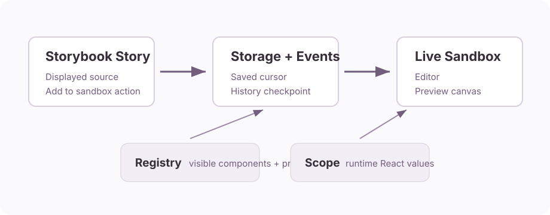
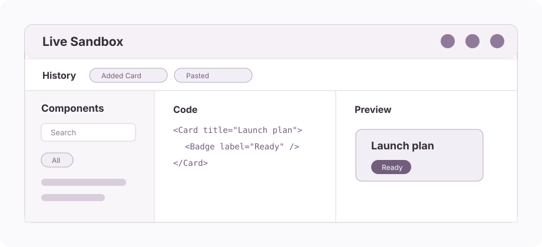

# Quick Start

This guide shows the smallest working setup for `storybook-live-code-sandbox` in a Storybook project.



## 1. Install

```sh
npm install storybook-live-code-sandbox
```

Your project also needs React and Storybook. The package expects `react`, `react-dom`, and `storybook` as peer dependencies.

## 2. Create A Runtime Scope

The scope is the set of values available when the sandbox evaluates JSX.

```ts
import * as Demo from "./DemoComponents";

export const liveCodeScope = {
  Button: Demo.Button,
  Card: Demo.Card,
  Badge: Demo.Badge,
};
```

## 3. Create A Registry

The registry controls what appears in the component sidebar and what snippets are inserted.

```ts
import type { LiveCodeRegistryItem } from "storybook-live-code-sandbox";

export const liveCodeRegistry: LiveCodeRegistryItem[] = [
  {
    name: "Button",
    category: "Actions",
    description: "Primary action button.",
    sandboxVisible: true,
    examples: [
      {
        name: "Primary",
        code: '<Button label="Save changes" variant="primary" />',
      },
    ],
    props: [
      { name: "label", type: "string", required: true, importance: "high" },
      { name: "variant", type: '"primary" | "secondary"', importance: "high" },
    ],
  },
];
```

Items are shown unless `sandboxVisible` is `false` or `disabledReason` is set.
Selectable items must have unique names, exist in the runtime scope, and expose
at least one safe, insertable example. Invalid items are hidden with a warning;
`validateLiveCodeRegistry(registry, scope)` returns structured diagnostics for
build tooling and tests.

## 4. Add One Sandbox Story



```tsx
import type { Meta, StoryObj } from "@storybook/react-vite";
import { addons } from "storybook/preview-api";
import { LiveCodeSandboxProvider } from "storybook-live-code-sandbox";
import "storybook-live-code-sandbox/styles.css";
import { liveCodeRegistry } from "./liveCodeRegistry";
import { liveCodeScope } from "./liveCodeScope";

const meta = {
  title: "Tools/Live Sandbox",
  parameters: { layout: "fullscreen" },
  render: () => (
    <LiveCodeSandboxProvider
      channel={addons.getChannel()}
      checkpointInterval={5}
      historyLimit={8}
      registry={liveCodeRegistry}
      scope={liveCodeScope}
      storageKey="my-storybook-live-sandbox"
    />
  ),
} satisfies Meta;

export default meta;
export const Workspace: StoryObj<typeof meta> = {};
```

## 5. Send Story Source To The Sandbox

Use the same source string Storybook shows in Docs. Do not rebuild examples from a second registry.

```ts
import { addons } from "storybook/preview-api";
import { addStoryToSandboxStorage } from "storybook-live-code-sandbox/storage";

await addStoryToSandboxStorage({
  channel: addons.getChannel(),
  code: '<Button label="Save changes" variant="primary" />',
  storageKey: "my-storybook-live-sandbox",
  storyName: "Primary Button",
});
```

The helper inserts the code at the saved sandbox cursor, creates an immediate history checkpoint, and keeps the user on the current story. It updates the sandbox draft without executing it. Open the sandbox and activate **Run** when the composition is ready to preview.

The `storage` subpath is asynchronous on purpose. It loads the JSX parser that finds a safe insertion point only when a transfer actually runs, so a Docs page that imports this helper does not pay for the parser on every page load. Call it from a click handler and handle the rejection.

## Runnable Example

The full basic example lives in [examples/basic-storybook](../examples/basic-storybook). It uses local demo components so you can see the sandbox working without Crossroads UI or any design-system dependency.

## Screenshots

The example opens with one shared `Tools/Live Sandbox` workspace and a component sidebar populated from the registry.


Selecting a component inserts the snippet into the editor and switches the sidebar to relevant prop suggestions.


After adding several snippets, activate **Run** to update the preview while history tracks composition checkpoints.


The settings dialog lets users tune insertion checkpoint frequency and retained history.


