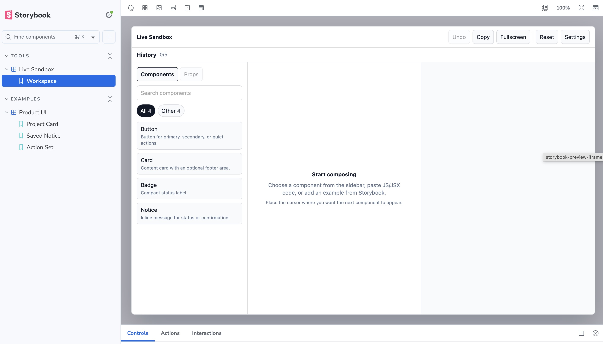
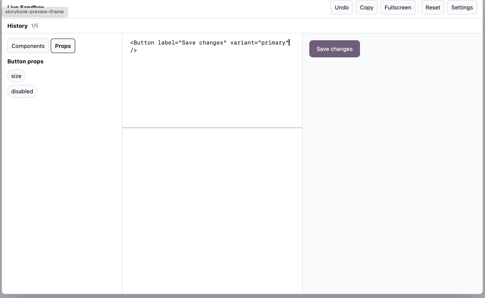
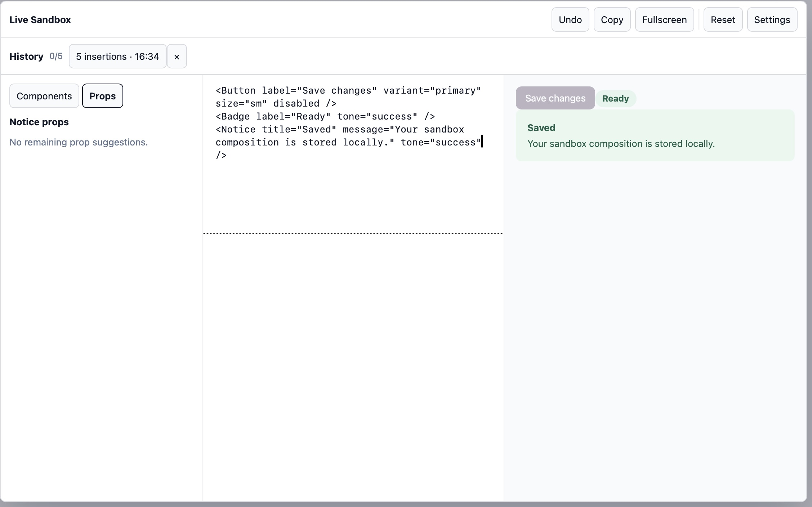
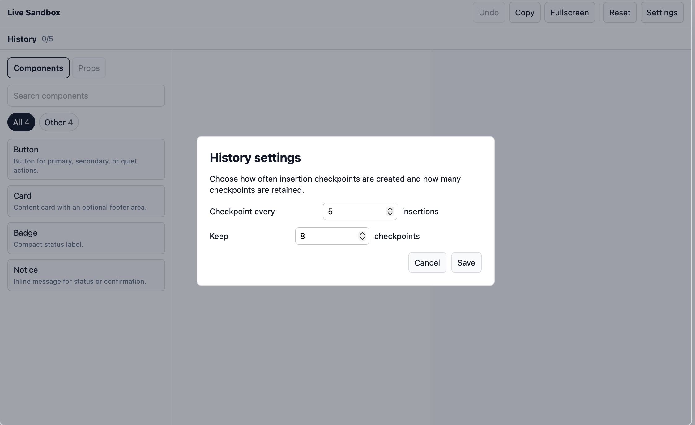

# Basic Storybook Example

This example shows `storybook-live-code-sandbox` with plain local React components. It does not depend on Crossroads UI or any design-system package.

## Run

```sh
npm install
npm run storybook
```

Then open `Tools/Live Sandbox`.



## What It Demonstrates

- A dedicated sandbox story.
- A small component registry.
- A runtime scope for `react-live`.
- Prop suggestions from registry metadata.
- Story examples that can send source into the shared sandbox storage.

## Screenshots







## Build

```sh
npm run build-storybook
```
